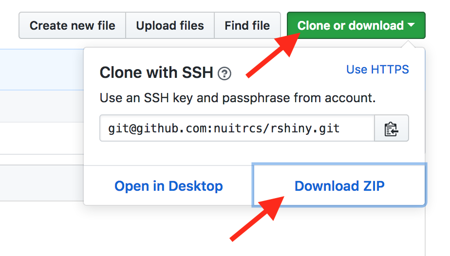

# R Shiny Workshop

R Shiny Workshop materials by Christina Maimone from [Northwestern Research Computing Services](http://www.it.northwestern.edu/research/).  


# Software and Files

For this workshop, you'll need to install some R packages and download the workshop files from this repository.

Keynote and Powerpoint versions of the slides will be included when you download the repository (below).  If you don't have either of these programs, try opening the slides with [Google Slides](https://docs.google.com/presentation/u/0/) or [PowerPoint Online](https://support.office.com/en-us/article/view-a-presentation-without-powerpoint-2f1077ab-9a4e-41ba-9f75-d55bd9b231a6).

## Option 1: On your laptop 

### R and RStudio

This workshop assumes you have recent versions of R and RStudio - R 3.4 or 3.5 and RStudio 1.1.

You'll also need the following packages and their dependencies installed and up to date:

* tidyverse
* shiny
* rmarkdown
* DT
* shinythemes
* rsconnect (for deploying to shinyapps.io)

```r
install.packages(c("tidyverse", "shiny", "rmarkdown", "DT", "shinythemes", "rsconnect"), 
                 repos="http://cran.rstudio.com")
```

To make sure everything is working, in RStudio, go to File :arrow_right: New File :arrow_right: Shiny Web App to create a new Shiny app, and click on the Run App button. This should launch an example application in a new window.

### Workshop Materials

To download workshop materials (final versions will be available 2-3 days before the event), click on the green Clone or Download button, then download the repository as a ZIP file.  



Find the downloaded .zip file on your computer, likely in your Downloads folder.  Unzip it - usually by double-clicking.  This will create a directory called rshiny.  Move this somewhere on your computer where you'll be able to find it, like your Documents folder.  

Double click on the .Rproj folder in the folder to launch the project in RStudio.  Alternatively, open RStudio, then go to File :arrow_right: Open Project and find the .Rproj file in the rshiny directory to open.

Alternatively, if you're familiar with git, you can create a new RStudio project directly from this repository (again, once the materials are posted).


## Option 2: RStudio Cloud

[RStudio Cloud](https://rstudio.cloud) is a way to run RStudio in your web browser.  Set up an account.  In Your Workspace, create a new project: Click on the down arrow next to New Project in the blue button, then select New Project from a Git Repository.  Provide the address of this repository: https://github.com/nuitrcs/rshiny.  This will copy all of the files from this repository into your new project.  


*You should wait until 2-3 days before the workshop to do this, to ensure you have the most current version of the workshop files.**

You will also need to install packages in this project space:

* tidyverse
* shiny
* rmarkdown
* DT
* shinythemes
* rsconnect (for deploying to shinyapps.io)

With the project open (opening the project will open RStudio in your web browser), install these with the R command

```r
install.packages(c("tidyverse", "shiny", "rmarkdown", "DT", "shinythemes", "rsconnect"), 
                 repos="http://cran.rstudio.com")
```

or use the buttons in the Packages window in the bottom right of RStudio to install them.


# Deploying Shiny Apps

One option for deploying Shiny applications to share with others is http://shinyapps.io.  This is a service of RStudio, and there is a free account option.  This workshop includes information on deploying your application to this service; this is an optional step.  

# Resources

See the [R Workshops Guide](https://github.com/nuitrcs/rworkshops) for links to general R resources.

## Shiny Resources

[Shiny Documentation](https://shiny.rstudio.com): reference, articles, tutorials, gallery, etc.  Start here.

[Shiny Cheat Sheet](https://github.com/rstudio/cheatsheets/raw/master/shiny.pdf)

[Shiny Examples](https://github.com/rstudio/shiny-examples): code for all of the examples in the official documentation and more

[Shiny Essentials Workshop Materials](https://github.com/rstudio-education/shiny-sdss18) from Mine Çetinkaya-Rundel

[Shiny and RMarkdown Workshop Materials](https://github.com/rstudio-education/intro-shiny-rmarkdown) from Mine Çetinkaya-Rundel

[Webinars from RStudio](https://www.rstudio.com/resources/webinars/): look for the Shiny and Advanced Shiny sections

# Acknowledgements

These workshop materials are largely based on various Shiny workshops, tutorials, and courses created by [Mine Çetinkaya-Rundel](https://github.com/mine-cetinkaya-rundel).  